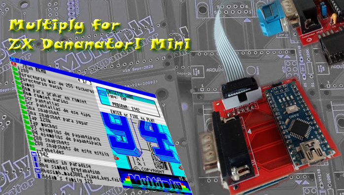

# Multiply. A microSD card addon for ZX Dandanator! Mini

Addon for [ZX Dandanator! Mini](http://www.dandare.es/Proyectos_Dandare/ZX_Dandanator!_Mini.html). A Spectrum ZX peripheral with many features.

[Youtube Video Link](https://www.youtube.com/watch?v=IbOcqb44hSs)

## :small_blue_diamond:Requirements
Arduino IDE, Sjasmplus or similar Z80 compiler

jar file for the [Java Romset generator](https://github.com/teiram/dandanator-mini.git)

## :small_blue_diamond:Cloning the repository
 git clone https://github.com/mad3001/Multiply

 
## :small_blue_diamond:Building
 1.Use the Arduino IDE to upload the sketch to the Multiply's Arduino Nano. This process requires the Multiply to be disconnected from the ZX Dandanator! Mini
 
 2.Use SJASMPlus to create the MLD file containing the navigation menu

 
## :small_blue_diamond:Executing
 1.Open the "Java Romset generator" and drag your newly built MLD file to the program list
 
 2.Connect the Multiply to the ZX Dandanator! Mini and, then, plug the cartridge to the expansion slot of your Spectrum. Once powered on, select "L-Loader" in the Spectrum's Dandanator menu and send your romset using the "Java Romset generator"
 
## :small_blue_diamond:License

Multiply is a team work by Dandare, Mad3001 and OverCLK.

If you are using any part of the code in this repository don''t forget to mention it if you make it public.

 LICENSE: CC BY-SA 4.0
 
 https://creativecommons.org/licenses/by-sa/4.0/
 
 
 
## :small_blue_diamond:Acknowledgedments
 
 Our sincere gratitude to Habi (Habisoft) for his invaluable support and his great emulator [es.pectrum](http://www.habisoft.com/espectrum/)

 Many thanks To Pagantipaco for the graphics and his amazing Menu design. [Link to Retroworks page](http://www.retroworks.es/index.php)

 Thanks to Antonio Villena for his modification to the original 48KB Spectrum rom allowing a tape auto load on boot
 
 Thanks to Bill Greiman for his Arduino SdFat Library. Source code of sdfat is not distributed with Multiply. SDFat licencing information available at: https://github.com/greiman/SdFat
 